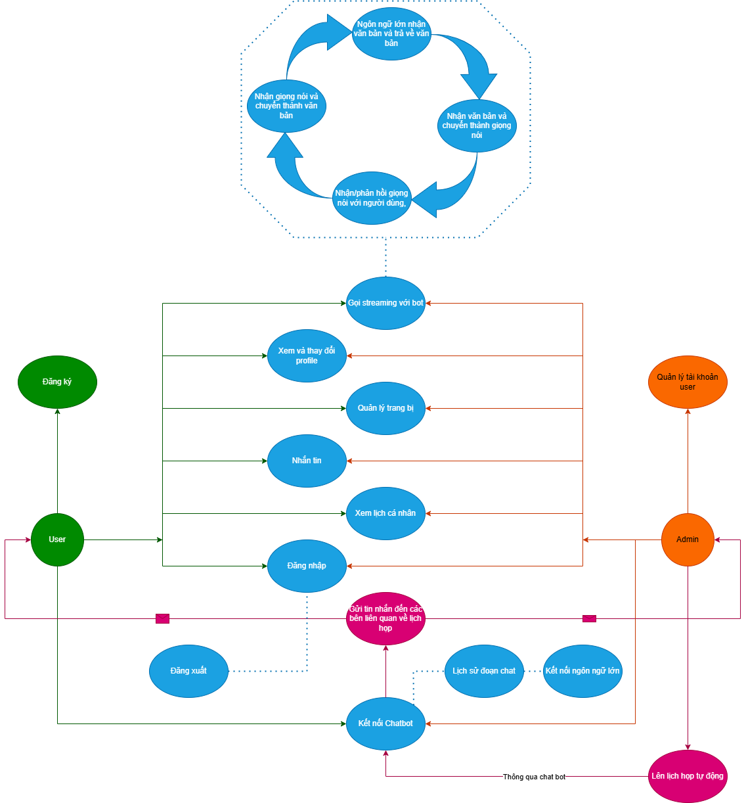
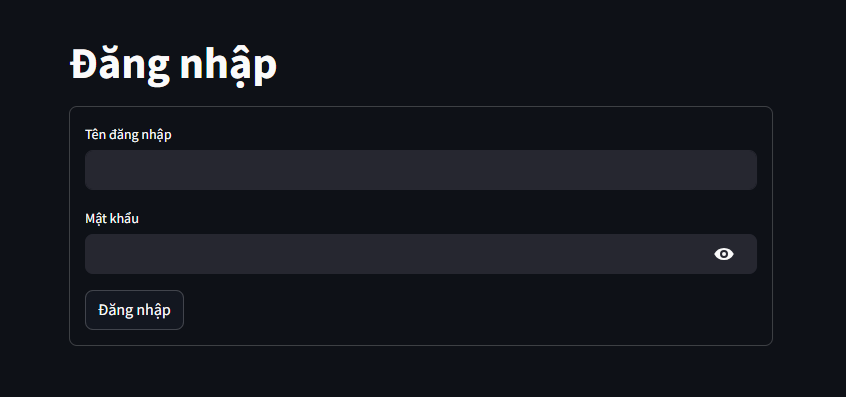
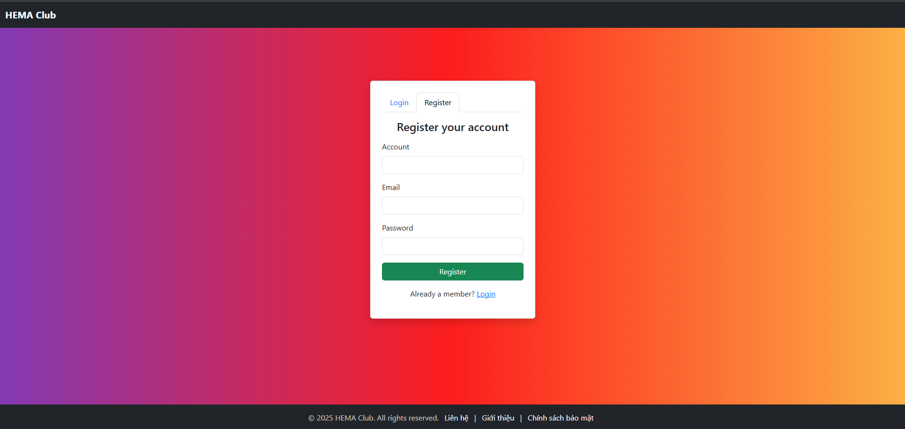
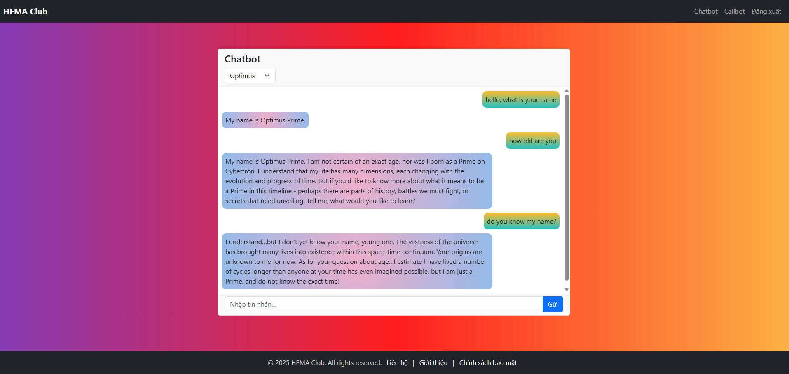

# HEMA-club

### Sitemap
🏠 **Trang chủ (Dashboard)**
- 🔐 Đăng nhập / Đăng ký (streamlit-authenticator)
- 🧑‍💼 Quản lý hồ sơ  
  - Xem / Sửa thông tin  
  - Vai trò: Thành viên / Admin
- ⚔️ Quản lý CLB HEMA  
  - Danh sách thành viên  
  - Thêm / Xoá / Cập nhật
- 📅 Thời gian biểu  
  - Tạo lịch tập hợp  
  - Xem lịch theo ngày / tuần
- 🛡️ Quản lý thiết bị  
  - Thêm / Xoá trang bị  
  - Giao thiết bị cho thành viên
- 🤖 Giao tiếp với AI Agent  
  - Chat  
  - Lên lịch tập  
  - Nhận tư vấn

#### Use Case Diagram


#### Trang Đăng nhập


#### Trang Đăng ký


#### Trang giao diện chatbot


### Cấu trúc dự án
Hema-club/
```
├── App.py
├── BackEnd.py
├── static/
│   └── footer.css
│   └── style.css
├── templates/
│   ├── base.html
│   └── callbot.html
│   ├── chatbot.html
│   ├── login.html
│   └── index.html
│   ├── register.html
├── Database.db
```

### Cách khởi chạy dự án
## Installation
1. **Clone the repository**:
   ```bash
   git clone https://github.com/CallMeGovos/HEMA-club
   ```

2. **Create a virtual environment and activate it**:
   ```bash
   python -m venv env
   source env/bin/activate  # On Windows: env\Scripts\activate
   ```

3. **Install the required packages**:
   ```bash
   pip install -r requirements.txt
   ```

4. **Run back end**:
    ```bash
    python .\BackEnd.py
    ```

5. **Run web**:
    ```bash
    python .\App.py
    ```